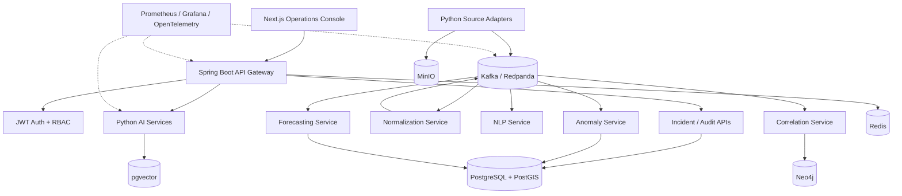

# AEGIS

Autonomous Event & Global Intelligence System — Nepal flood-risk intelligence MVP.

> Portfolio status: Phase 2 — ingestion and normalization complete. The platform now ingests replayed and live weather, hydrology, road-disruption, and public-report signals with persistence, retries, idempotency, health reporting, and CI verification.

## Project Links

| Resource | Link |
| --- | --- |
| Repository | [Bishrav/AEGIS](https://github.com/Bishrav/AEGIS) |
| Architecture | [`docs/architecture/overview.md`](docs/architecture/overview.md) |
| API overview | [`docs/api/overview.md`](docs/api/overview.md) |
| Delivery roadmap | [`docs/roadmap.md`](docs/roadmap.md) |
| Operations runbook | [`docs/operations/local-development.md`](docs/operations/local-development.md) |

## What AEGIS Does

AEGIS continuously ingests heterogeneous public signals, normalizes them into versioned events, detects rainfall and river anomalies, forecasts short-horizon conditions, correlates events across time and geography, builds an infrastructure dependency graph, calculates a transparent risk score, and retrieves evidence for grounded AI explanations.

The MVP focuses on flood-risk intelligence for Nepal. It deliberately keeps deterministic services and evaluated models as the source of truth; LLMs explain evidence and reasoning but do not directly generate risk scores.

## MVP Vertical Slice

```mermaid
flowchart LR
  sources[Weather / Hydrology / Roads / Reports] --> adapters[Source Adapters]
  adapters --> raw[Raw Payload Storage]
  adapters --> kafka[Kafka Topics]
  kafka --> normalize[Canonical Normalization]
  normalize --> ai[NLP / Anomaly / Forecasting]
  ai --> correlate[Temporal + Spatial Correlation]
  correlate --> graph[Neo4j Incident Graph]
  graph --> risk[Versioned Risk Engine]
  risk --> rag[Hybrid Evidence Retrieval]
  rag --> explain[Evidence-Grounded Explanation]
  explain --> api[REST API + Dashboard]
```

## Features

### Product Features

- Flood-risk incidents for Nepal districts and infrastructure.
- Weather, river, road-disruption, and public-report signal ingestion.
- Incident timeline, event evidence, forecast, risk components, and graph view.
- Historical flood-document retrieval with evidence IDs.
- Analyst alert acknowledgement, incident notes, and status workflow.
- Role-based access for `ADMIN`, `ANALYST`, and `VIEWER`.
- Replay mode for reproducible incident demonstrations.
- Frozen replay fixtures for all four MVP signal categories.

### Engineering Features

- Versioned canonical event contracts with schema validation.
- Idempotent ingestion, deduplication, retries, and dead-letter handling.
- Kafka-compatible streaming through Redpanda for local development.
- TF-IDF + Logistic Regression baseline compared with a transformer classifier.
- Hybrid NER using pretrained extraction, gazetteers, and deterministic rules.
- Statistical and Isolation Forest anomaly detection.
- Naive, seasonal, ARIMA, and XGBoost forecasting comparisons.
- Algorithmic temporal, spatial, entity, and relationship correlation.
- Neo4j graph projection with BFS impact traversal and shortest-path queries.
- Deterministic, policy-versioned risk scoring with stored components.
- PostgreSQL/PostGIS + pgvector hybrid retrieval.
- Provider-neutral LLM adapters with mock support for tests.
- PostgreSQL, Redis, Neo4j, MinIO, Kafka, Prometheus, and Grafana.
- Unit, contract, integration, replay, performance, and failure-injection tests.
- OpenTelemetry traces, structured logs, metrics, and CI quality gates.
- Typed adapter contract with deterministic canonical event IDs.
- Idempotent raw-record capture, duplicate suppression, and dead-letter routing.
- MinIO raw-payload persistence and Kafka normalized-event publication.
- Runnable replay API for the four MVP signal categories.
- Retry with bounded exponential backoff and source-health reporting.
- Redis-backed idempotency claims for restart-safe ingestion.
- Live Open-Meteo weather and BIPAD hydrology/incident adapters.

## Architecture



## Local Development

```powershell
Copy-Item .env.example .env
docker compose up -d
```

The local platform includes PostgreSQL/PostGIS, Redpanda, Redis, MinIO, Neo4j, Prometheus, and Grafana. Service-specific setup will be added as each phase becomes executable.

## Repository Structure

```text
apps/                    API gateway and dashboard
services/                Ingestion and processing services
algorithms/              Correlation and graph algorithms
ml/                      Training, inference, and evaluation
schemas/                 Versioned contracts and event topics
infrastructure/          Docker, monitoring, and deployment assets
tests/                   Unit, contract, integration, performance, and E2E tests
benchmarks/              Reproducible performance benchmarks
docs/                    Architecture, ADRs, API, security, and operations
```

## Delivery Roadmap

- Phase 0 — GitHub portfolio standard, documentation, contribution workflow, and project evidence structure. **Complete.**
- Phase 1 — Docker platform foundation, service scaffolding, health checks, schemas, and Kafka topics. **Complete and runtime-verified.**
- Phase 2 — Source adapters, raw payload storage, normalization, deduplication, retries, and replay fixtures. **Complete and integration-verified.**
- Phase 3 — NLP extraction, anomaly detection, forecasting baselines, and model evaluation.
- Phase 4 — Correlation, Neo4j graph intelligence, deterministic risk scoring, and auditability.
- Phase 5 — Hybrid RAG, evidence packaging, provider-neutral LLM reasoning, and citation validation.
- Phase 6 — JWT/RBAC, REST API, analyst workflows, Next.js dashboard, and live updates.
- Phase 7 — Full verification, load/failure testing, observability, deployment, screenshots, benchmarks, and recruiter demo.

## Portfolio Evidence

Each completed phase will include an acceptance checklist, architecture decision records, test evidence, benchmark results where applicable, and a reproducible demonstration. The README will only claim completed features after they are verified in CI or through documented local evidence.

Phase 2 evidence is summarized in [`docs/phase-reports/phase-2.md`](docs/phase-reports/phase-2.md).

## Scope Boundaries

The first release does not include wildfire intelligence, disease detection, economic crises, multi-agent coordination, full digital-twin simulation, Kubernetes, autonomous decision-making, or advanced deep-learning forecasting.
