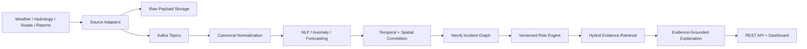
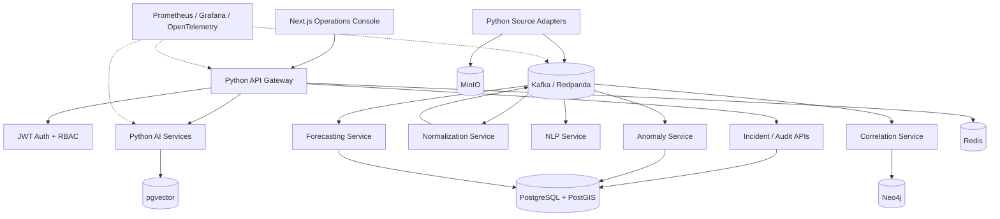

# AEGIS

Autonomous Event & Global Intelligence System — Nepal flood-risk intelligence MVP.

> Portfolio status: Phase 7 — production evidence in progress. AEGIS includes a secured operations dashboard, live incident workflow, evidence retrieval, and a repeatable end-to-end acceptance harness.

## Project Links

| Resource | Link |
| --- | --- |
| Repository | [Bishrav/AEGIS](https://github.com/Bishrav/AEGIS) |
| Architecture | [`docs/architecture/overview.md`](docs/architecture/overview.md) |
| API overview | [`docs/api/overview.md`](docs/api/overview.md) |
| Delivery roadmap | [`docs/roadmap.md`](docs/roadmap.md) |
| Operations runbook | [`docs/operations/local-development.md`](docs/operations/local-development.md) |
| Railway deployment | [`docs/operations/railway.md`](docs/operations/railway.md) |
| Render deployment | [`docs/operations/render.md`](docs/operations/render.md) |
| Free Render portfolio deployment | [`render.free.yaml`](render.free.yaml) |
| Vercel portfolio deployment | [`docs/operations/vercel.md`](docs/operations/vercel.md) |
| Live dashboard | [aegis-dashboard-beta.vercel.app](https://aegis-dashboard-beta.vercel.app) |
| Recruiter demo | [`docs/portfolio/recruiter-demo.md`](docs/portfolio/recruiter-demo.md) |
| Local dashboard | [http://localhost:3001](http://localhost:3001) |
| API gateway docs | [http://localhost:8000/docs](http://localhost:8000/docs) |

## What AEGIS Does

AEGIS continuously ingests heterogeneous public signals, normalizes them into versioned events, detects rainfall and river anomalies, forecasts short-horizon conditions, correlates events across time and geography, builds an infrastructure dependency graph, calculates a transparent risk score, and retrieves evidence for grounded AI explanations.

The MVP focuses on flood-risk intelligence for Nepal. It deliberately keeps deterministic services and evaluated models as the source of truth; LLMs explain evidence and reasoning but do not directly generate risk scores.

## MVP Vertical Slice



## Features

### Product Features

- Flood-risk incidents for Nepal districts and infrastructure.
- Weather, river, road-disruption, and public-report signal ingestion.
- Incident timeline, event evidence, forecast, risk components, and graph view.
- Historical flood-document retrieval with evidence IDs.
- Analyst alert acknowledgement, incident notes, and status workflow.
- Role-based access for `ADMIN`, `ANALYST`, and `VIEWER`.
- Replay mode for reproducible incident demonstrations.
- Frozen replay fixtures for all four MVP signal categories.

### Engineering Features

- Versioned canonical event contracts with schema validation.
- Idempotent ingestion, deduplication, retries, and dead-letter handling.
- Kafka-compatible streaming through Redpanda for local development.
- TF-IDF + Logistic Regression baseline compared with a transformer classifier.
- Hybrid NER using pretrained extraction, gazetteers, and deterministic rules.
- Statistical and Isolation Forest anomaly detection.
- Naive, seasonal, ARIMA, and XGBoost forecasting comparisons.
- Algorithmic temporal, spatial, entity, and relationship correlation.
- Neo4j graph projection with BFS impact traversal and shortest-path queries.
- Deterministic, policy-versioned risk scoring with stored components.
- PostgreSQL/PostGIS + pgvector hybrid retrieval.
- Provider-neutral LLM adapters with mock support for tests.
- PostgreSQL, Redis, Neo4j, MinIO, Kafka, Prometheus, and Grafana.
- Unit, contract, integration, replay, performance, and failure-injection tests.
- OpenTelemetry traces, structured logs, metrics, and CI quality gates.
- Railway-ready isolated ingestion deployment with Dockerfile, healthcheck, and config-as-code.
- Next.js operations console with Overview, Incidents, Evidence, Knowledge Graph, Model Evaluation, Source Health, and Observability pages.
- JWT-cookie authentication, RBAC-protected gateway routes, live incident listing, status updates, and analyst notes.
- Typed adapter contract with deterministic canonical event IDs.
- Idempotent raw-record capture, duplicate suppression, and dead-letter routing.
- MinIO raw-payload persistence and Kafka normalized-event publication.
- Runnable replay API for the four MVP signal categories.
- Retry with bounded exponential backoff and source-health reporting.
- Redis-backed idempotency claims for restart-safe ingestion.
- Live Open-Meteo weather and BIPAD hydrology/incident adapters.
- Reproducible TF-IDF + Logistic Regression flood-report classification baseline.
- Initial NLP baseline metrics are recorded and evaluated in CI; current macro F1 is 0.667 on the starter dataset.
- Hybrid gazetteer/rule NER for districts, rivers, roads, and dates.
- Z-score plus Isolation Forest anomaly ensemble.
- Naive and seasonal forecasting baseline comparison.

## Architecture



## Local Development

```powershell
Copy-Item .env.example .env
docker compose up -d
```

The local platform includes PostgreSQL/PostGIS, Redpanda, Redis, MinIO, Neo4j, Prometheus, and Grafana. Service-specific setup will be added as each phase becomes executable.

## Repository Structure

```text
  frontend/               Next.js operations dashboard
  services/api/            Authenticated API gateway
  services/auth/           JWT authentication and RBAC
services/                Ingestion and processing services
algorithms/              Correlation and graph algorithms
ml/                      Training, inference, and evaluation
schemas/                 Versioned contracts and event topics
infrastructure/          Docker, monitoring, and deployment assets
tests/                   Unit, contract, integration, performance, and E2E tests
benchmarks/              Reproducible performance benchmarks
docs/                    Architecture, ADRs, API, security, and operations
```

## Delivery Roadmap

- Phase 0 — GitHub portfolio standard, documentation, contribution workflow, and project evidence structure. **Complete.**
- Phase 1 — Docker platform foundation, service scaffolding, health checks, schemas, and Kafka topics. **Complete and runtime-verified.**
- Phase 2 — Source adapters, raw payload storage, normalization, deduplication, retries, and replay fixtures. **Complete and integration-verified.**
- Phase 3 — NLP extraction, anomaly detection, forecasting baselines, and model evaluation. **Complete and CI-verified.**
- Phase 4 — Correlation, Neo4j graph intelligence, deterministic risk scoring, and auditability. **Complete and integration-verified.**
- Phase 5 — Hybrid RAG, evidence packaging, provider-neutral LLM reasoning, and citation validation. **Complete and Supabase-verified.**
- Phase 6 — JWT/RBAC, REST API, analyst workflows, Next.js dashboard, and live updates. **Complete.**
- Phase 7 — Full verification, load/failure testing, observability, deployment, screenshots, benchmarks, and recruiter demo. **In progress.**

## Portfolio Evidence

Each completed phase will include an acceptance checklist, architecture decision records, test evidence, benchmark results where applicable, and a reproducible demonstration. The README will only claim completed features after they are verified in CI or through documented local evidence.

Phase 2 evidence is summarized in [`docs/phase-reports/phase-2.md`](docs/phase-reports/phase-2.md).

Phase 3 includes the reproducible NLP baseline, hybrid NER, anomaly ensemble, forecasting comparison, and typed inference schemas.

Phase 3 evidence is summarized in [`docs/phase-reports/phase-3.md`](docs/phase-reports/phase-3.md).

Phase 4 completion evidence is documented in [`docs/phase-reports/phase-4-progress.md`](docs/phase-reports/phase-4-progress.md), including the four-source replay, managed Kafka worker, Postgres persistence path, Neo4j integration test, and immutable risk audit records.

Phase 5 progress is documented in [`docs/phase-reports/phase-5-progress.md`](docs/phase-reports/phase-5-progress.md), including stable evidence IDs, hybrid retrieval, Recall@K evaluation, and the provider-neutral explanation boundary.

The Phase 5 implementation includes a Supabase/Postgres-compatible evidence migration, incident evidence search API, citation-enforcing reasoning service, configurable OpenAI-compatible provider boundary, and backend-only RLS protection.

Phase 5 completion evidence is documented in [`docs/phase-reports/phase-5.md`](docs/phase-reports/phase-5.md).

Phase 6 progress is documented in [`docs/phase-reports/phase-6-progress.md`](docs/phase-reports/phase-6-progress.md), beginning with the tested RBAC policy foundation.

The Phase 6 authentication API is available locally at `http://localhost:8006/docs`.

The authenticated dashboard-facing API gateway is available locally at `http://localhost:8000/docs`.

The AEGIS operations dashboard is available locally at `http://localhost:3001`.

Dashboard routes:

- `/` — Overview
- `/incidents` — Incident queue
- `/incidents/INC-042` — Incident detail and risk timeline
- `/evidence` — Hybrid evidence explorer
- `/graph` — Knowledge graph view
- `/models` — Model evaluation
- `/sources` — Source health
- `/observability` — Runtime telemetry

Phase 6 is complete: live incident listing and detail pages, RBAC-protected status updates, analyst notes, Redis-backed SSE incident updates, evidence search, Docker verification, and authenticated end-to-end acceptance checks are documented in [`docs/phase-reports/phase-6-progress.md`](docs/phase-reports/phase-6-progress.md).

Phase 7 progress is documented in [`docs/phase-reports/phase-7-progress.md`](docs/phase-reports/phase-7-progress.md). Its first milestone is a repeatable local end-to-end acceptance harness covering authentication, evidence, correlation, risk, analyst actions, and live updates.

The recruiter-ready walkthrough and screenshot checklist are in [`docs/portfolio/recruiter-demo.md`](docs/portfolio/recruiter-demo.md). A public Railway deployment is only claimed after the deployment smoke test passes against a configured project.

Railway deployment instructions are documented in [`docs/operations/railway.md`](docs/operations/railway.md). The repository is deployment-ready; the public service is not claimed as deployed until the Railway project and dependency bindings are configured.

## Scope Boundaries

The first release does not include wildfire intelligence, disease detection, economic crises, multi-agent coordination, full digital-twin simulation, Kubernetes, autonomous decision-making, or advanced deep-learning forecasting.
